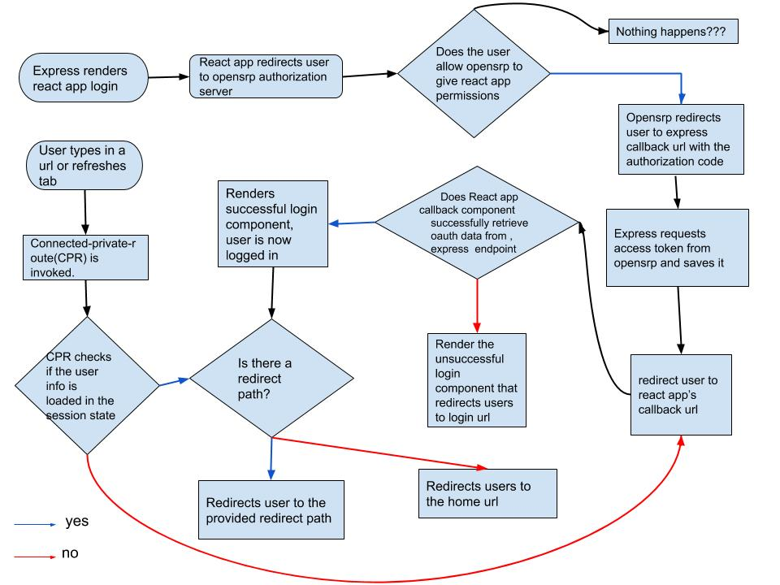

# Authorization code flow implementation for Reveal

## Steps

1. User(resource-owner) loads domain in browser(user-agent), the browser request is initially handled by express which returns the react-app files.

2. [Assuming we start at login] user clicks on provider link, the react-app directs the user to the opensrp authorization server

3. After the user accepts to the authorization, the authorization server, redirects the user to the express callback route with the authorization code.

4. The express callback uses the authorization code to query for an access-token from the server; saves the session and sets a secure httpOnly cookie that contains the session ID.

5. If there is a url passed in as a value to the `next` key in the url, then redirect to given url; otherwise redirect to react-app's callback url.

6. The rendered callback component from [@onaio/gatekeeper](https://github.com/onaio/js-tools/blob/master/packages/gatekeeper/README.md) attempts to get the authentication details from the express server via an exposed endpoint and hydrates the state with the same.

7. [On success]: the callback component renders the successfulLogin component. [jump to 9].

8. [On Failure]: the callback component renders the UnsuccessfulLogin component. [jump to 10].

9. The SuccessfulLogin component checks if there is a redirectTo path defined. If one is defined then it redirects the user to the said path, if the path is not defined then the user is redirected to the home url.

10. The unsuccessful login component redirects the user to the login url, if the user had tried accessing a url before logging in, that url will be appended to the login url as a search parm in the form `?next=<url>`.

11. Where the user either refreshes or opens the app in new page. The connected private route [@onaio/connected-private-route](https://github.com/onaio/js-tools/blob/master/packages/connected-private-route/README.md) component provides the initial point of contact.

12. The component checks the reducer session store for authentication status

13. If the user details are not found in the store then it directs the user to the **no. 5** .

14. If the connected-private-route finds that the user is logged in then they let the user redirect to the route that they initially wished to view.

A flow diagram representing this flow can be seen below :
.
